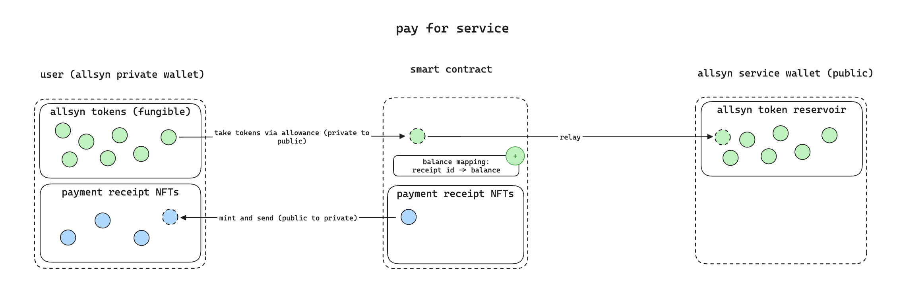
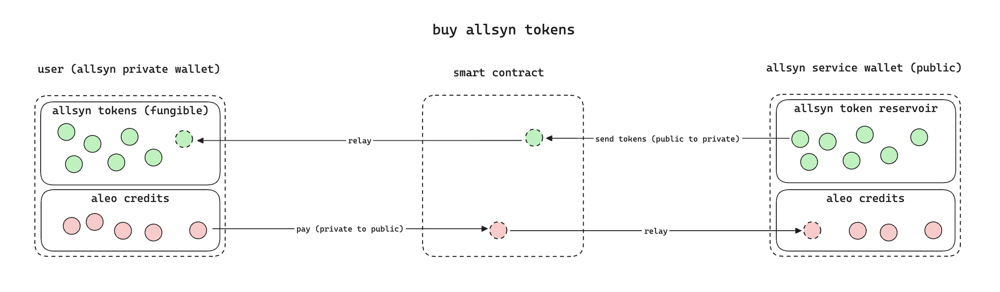
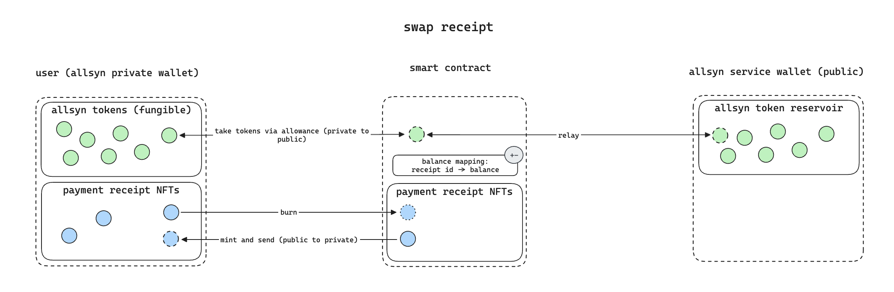
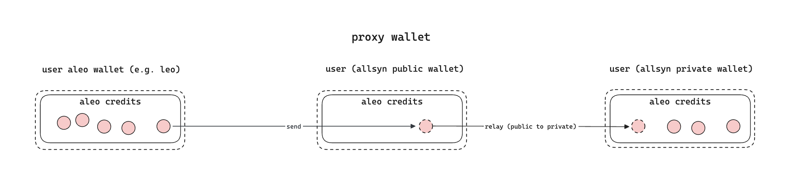

### 1 - Problem

A reliant selfhosting setup requires a monitoring set up. But who monitors the monitor? A decentralized and unstoppable monitoring solution can solve the chicken-egg problem that self-hosters run into.

### 2 - The product

Allsyn (swedish term for "all sight") is an unstoppable web3 uptime monitoring tool, with the following properties:

- Hackresistant, private onchain registry of monitoring targets
- Decentralized uptime checks
- Crypto payment / subscription system behind the scenes
- Painless onramp from fiat
- Trustless / crypto incentivized alerting to mobile app
- Hack-resistant wallet integration

Unstoppable / hack-resistant means that your monitoring continues to run even at the worst level of compromise / failure in case of a hack or system crash.

Crypto complexity is abstracted away in the user interface.

Painless onramp like paying on web2 platforms.

Trustless alerting means you don't have to trust me as a provider to deliver the alerts. A failure to alert is punished by slashing of rewards.

[Demo video of mvp](https://lvpr.tv?v=f52a6acfdc3zdub5)

### 3 - Technology

Allsyn leverages advancements in technology to offer a product with best-in-class UX and the above properties.

Aleo, Irys, Checker network, Randamu are the key technologies that enable this product.

**3.1 - Allsyn is on aleo chain**

We deploy a smart contract on aleo and provide our own "allsyn token" for users to pay for allsyn.
Aleo is the blockchain of choice as it offers private NFT ownership.

**3.1.1 - Allsyn tokens**

Checks are paid for in allsyn tokens (fungible tokens) through the allsyn smart contract.

As a user buys / registers a check with allsyn tokens on the allsyn aleo smart contract, he receives a payment receipt NFT in private that contains details on the checks that are to be performed.

Requiring users to pay with allsyn tokens enables us to set up an allowance for efficient subscription services. The allsyn smart contract can thereby regulary top up a specific monitors balance without requiring user action.



Allsyn tokens can be bought through a transition on the allsyn smart contract.




**3.1.2 - Payment receipts**

So to say, every registered check is a payment receipt NFT on aleo:

```ts
struct MetaData {
    // irys tx id has 32 bytes of raw data - fits into field.
    irys_tx_id: [u128; 2],
}

struct Data {
    metadata: MetaData, // URI of off-chain metadata JSON
    // Optional fields like name, image, attributes can be added here
}

record Receipt {
    private owner: address,
    private edition: scalar,
    public token_id: field,
    public data: Data,
    // transacted amount of check cycles, cannot be < 0 and is integer.
    public check_cycles: u64,
    // At what valuation was the receipt generated?
    public valuation: DecimalValue,
}
```

The receipts function is two-fold:

1. Users can trade back the remaining balance on a check using their latest receipt (proof of payment)
2. Receipt NFTs hold the information on the checks that are to be performed

While ownership is private, the monitoring registry (of receipts) is public (e.g. the domain to be monitored).

As mentioned above, users should be able to stop their subscription / exchange one subcription for another. This can be facilitated by offering receipt swaps, where a user turns in

- their latest receipt
- additional allsyn tokens (optional)
- a monitoring change request (e.g. other domain) or refund request

Then the smart contract calculates the remaining balance for the monitor in question and either returns the funds to the user and / or mints a new receipt for the user of the appropriate amount and potentially the changed monitor target.

To avoid trading with allsyn tokens unrelated to the product, we require a minimum duration for the receipt activity.



**3.1.3 - Allsyn proxy wallet**

We want to prevent malicious actors to be able to link wallet addresses to domains or web2 infrastructure. That's why ownership of payment receipts is private in allsyn. Any public facing payment flows to the allsyn wallet might link the user to a domain (through amount analysis, especially with little users on allsyn). It is therefore paramount that aleo credits are onboarded privately (as a public-to-private transition).

Allsyn introduces a proxy wallet system to enforce that users don't accidentally leak their identity by using a public-to-public transaction when onboarding money.

This system consists of one public facing wallet and one private facing wallet that never interacts publicly.

The allsyn UI never reveals the public or private key of the private facing wallet to the user to avoid abuse.



The allsyn wallet should offer best-in-class UX, be self-custodial whilst not requiring users to write down a keyphrase

**3.2 - Metatdata on Irys**

We store NFT metadata perpetually on irys as it offers the following benefits:

- Very cost efficient storage
- Robust perpetual economics
- Fast retrieval

**3.3 - Uptime checks with checker network**

Checker network is our tool for decentralized uptime checks.
Decentralization is important, as we want self hosters to be able self-host monitoring whilst relying on a distributed network to continue monitoring if their infrastructure fails.

Users have the option to self-host allsyn in which case they will run a checker network node and receive payments for the checks they run.

Allsyn enables custom time intervals for checks. So how can a node in checker network know when to check what without a centralized scheduler?

A probabilistic approach is the solution. We define checker network schedule rate as once per second.

Let the interval `(1, N)` define the indexes of each check. For a checker network node to retrieve the details of the check to be performed, it randomly generates a check index, which it can then use to query the check details that need to be performed.

As each check defines a custom frequency and how many checker nodes should be utilized, we need to use a weighted random number generation. Walkers Alias method comes in handy (https://stats.stackexchange.com/questions/198431/how-to-understand-the-alias-method-for-generating-discrete-random-variables).

We define the weight of a check `i` being selected as `w_i = (f_i * C_i)` where `f_i = frequency check i` and `C_i = requested checker nodes i`.

Understand, that the subset of the checker network that is to be utilized every second is: `u = W / A`, where `W = sum over i=1 to N (w_i)`, `N = registered checks`, `A = count of checker nodes in network`.

The following scheduling algorithm arises (for `W <= A`):

1. Every second, each checker node generates a random integer in `[1, A]`. If it is within `[1, W]`, this node is selected to perform a check -> continue to step 2. Otherwise, wait for next second.

2. Pick an integer from the weighted random distribution with `weights w_i` and `i within [1, N]` using Walkers alias method. This integer represents the check that is to be performed.

Random integers should be generated using drand. The proof of the above generation needs to be included alongside the check when publishing the check result. This is to avoid nodes falsely claiming it was their turn.

Nodes need to frequently query other nodes for the generated random numbers and verify that the number generation was correct and based on the on-chain state. This is to make sure nodes don't cheat and try to escape their checks.

Normally check avoidance shouldn't be an issue due to the incentive nature of checker network. However, there might be targeted attempts to avoid checks for specific domains. A sufficient amount of honest nodes in the network guarantees a certain robustness against these attacks.

The check results are stored in a decentralized database or even better a ledger that protects against the following:

- Delayed submission of check results. For check cycle `t` we only allow the submission until check cycle `t+n`. Everything afterwards will be ignored.
- Check avoidance or unselected check submittance by nodes (every and only selected nodes must submit check results)
- Check result reveal before next cycle, as check results need to be hidden to favour honest result submission (when a node knows the other nodes check results it can adjust it's own results to optimize payouts)
- Faking of time stamps (nodes shall not be able to register checks in hindsight)

**3.3.1 - Alerts**

Allsyn also offers a mobile and desktop app as well as daemons on most operating systems that queries the database on it's own and sends alerts to endpoints of a users desire. By default alerts will be sent via email and to the phone app, but other integrations are potentially thinkable.

The more services run the alerting app, the less likely the chance of a breach affecting the alerting functionality. So it is advisable to install allsyn software on all devices available to the user.

**3.4 - Allsyn app**

Allsyn exists as a browser app and native apps on both mobile and desktop. It offers:

- Alerting functionality
- Proxy wallet interface
- Easy, web2 comparable onramping

The main reason to implement a dedicated wallet is to provide better UX around dedicated transactions for allsyn. E.g. batching together several chain transactions to one user interaction.

A main problem when implementing a wallet is recovery. The holy grail is when a user doesn't need to remember a phrase to recover his seed phrase.

Diverse technologies are available to achieve this:

- randa.mu conditional decryption
- passkeys
- proof of identity with privado.id or rarimo
- proof of ownership (physical security key)

Allsyn proposes a multi-staged recovery system:

Private keys are stored on all devices using passkeys.

To add a new device one of the old devices needs to agree or a physical security key needs to be presented. Keys are replicated p2p.

In case the physical security key goes missing, recovery is possible with either a backup phrase or proof of identity, but with a waiting phase of x days. Within these x days, the user will receive alerts on all devices, that someone is trying to recover his private key. He can then either cancel the recovery or do nothing. In case of nothing, the keys will be decrypted using randa.mu conditional encryption.

The trust assumption here is that at least one device controlled by the user is not affected by the attack and that the randa.mu network is trustworthy.

A malicious entity will fail to add a new device as long as there is no sufficiently infected device already present.
It will also fail to recover as long as the user declines recovery within x days.

Needless to say, this is WIP and needs a lot of refinement.

### 4 - Current implementation state

Features currently implemented and to be implemented:

- [x] Mint allsyn token on aleo
- [x] Generate payment receipt on aleo
- [x] Register uptime checks on aleo
- [x] Public balance of checks on aleo
- [x] Basic uptime checks with checker network to centralized database, no incentives and fraud protection. (only https tests, no port checks as `net` module is not available in `zinnia`)
- [x] NFT metadata storage on Irys
- [x] Basic frontend to add and view uptime checks
- [ ] Decentralized, incentivized and fraud protected checker network
- [ ] Swap uptime checks
- [ ] Subscription and allowance system on aleo
- [ ] Mobile app
- [ ] Desktop app
- [ ] Wallet
- [ ] Alerts

### 5 - Development

This is how you get started:

1. Make sure you have installed all dependencies, noteworthy: `node@22`, `pnpm@10`, `leo`, `snarkOS`, `amaraleo-chain`, `parallel` (gnu parallel)
2. Run `pnpm i` from the root of your project. This will also install `zinnia` for you automatically, depending on your environment. It will require your root password from you.
3. Start a docker environment (e.g. Rancher Desktop or Docker Desktop) on your computer with `docker compose` available (not `docker-compose`!).
4. Make sure you have a solana wallet setup with sufficient devnet credits (e.g. 1 SOL). The app needs this to mint tokens on irys.

Then, to start developing:

1. Setup `.env` file in the root of the project
2. Run node packages from root: `pnpm dev`. This will start the frontend.
3. Initialize chain: `pnpm init-chain-dev`.
4. Go to the frontend: `http://localhost:5173`

**A couple of hints for the initialization of the development repo:**

!!! dont have a VPN running, as this will lead to problems with the amareleo-chain intialization

The setup is a little bit fragile currently. I think it is due to amareleo-chain and that `init-chain-dev.sh` is not very smart and doesnt wait for transactions to have gone through before it runs the next.

When running `pnpm init-chain-dev` or `pnpm add-irys` you have the following options:

- Should you run into an error similar to `Failed to fetch program allsyn.aleo: Response[status: 500, status_text: Internal Server Error, url: http://0.0.0.0:3030/testnet/program/allsyn.aleo]`, run the `pnpm init-chain-dev` command again, as this is probably due to the previous transaction not being finalized yet.
- Should you run into an error like `http://0.0.0.0:3030/testnet/block/height/latest: Connection Failed: Connect error: Can't assign requested address (os error 49)`, make sure that your VPN is switched of. Then re-run `pnpm dev` and `pnpm init-chain-dev` or `pnpm add-irys` (whatever you have run that caused the error). You can switch your VPN on again afterwards.
- If nothing helps, restart your computer.
